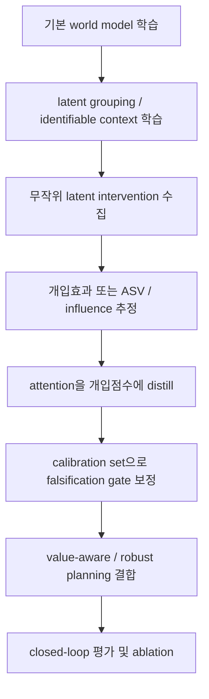
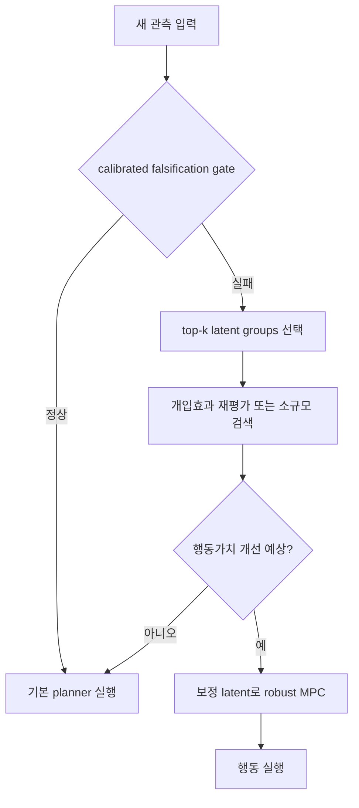

# Attention 기반 잠재 원인 귀속을 개입 유효하게 만드는 통계적 방법

## 요약

결론부터 말하면, **attention 자체를 “원인 점수”로 해석하는 것은 이론적으로 방어가 약합니다.** 기존 문헌은 표준 attention이 출력과의 상관은 가질 수 있어도, 대체 attention으로 거의 같은 예측을 만들 수 있고, gradient·삭제 실험과도 종종 불일치하며, 무엇보다 “다른 것은 고정한 채 attention만 외과적으로 개입”하는 것이 보통 불가능하다고 지적했습니다. 따라서 **attention은 설명 그 자체가 아니라, 실제 개입 가능한 latent gate를 생성하는 정책(policy)로 재정의**해야 합니다. citeturn39search6turn40search0turn39search2turn35search5

월드모델 falsification에서 가장 방어력 있는 설계는 다음 세 층을 동시에 갖는 것입니다. 첫째, **식별 가능하거나 적어도 그룹화된 latent 요인**을 만들고, 둘째, **무작위화된 latent intervention**으로 각 그룹의 평균 개입효과를 추정하여 attention을 그 효과에 정렬시키며, 셋째, **conformal/리스크 제어 또는 순차 검정**으로 “지금 틀렸다”는 탐지를 보정하고, 마지막으로 **value-aware/robust control 목적**으로 실제 행동 수정이 return에 관련되도록 강제하는 것입니다. 이 조합은 causal validity, statistical calibration, action relevance라는 세 독립 축을 동시에 충족합니다. citeturn24search1turn24search0turn32search1turn39search0turn22search0turn22search14turn26search2turn25search0turn25search1turn36search1turn7search0turn6search9

실무적으로는 **TD-MPC2류의 implicit latent world model 또는 Dreamer/RSSM류의 recurrent state-space model 위에**,  
**(a) conformal falsification gate + (b) randomized sparse latent gate + (c) interventional utility 정렬 + (d) robust MPC**를 얹는 구성이 가장 유망합니다. sim-to-real 적응에서는 latent residual 보정(ReDRAW)이나 mismatch 진단 후 선택적 미세조정(AdaWM)과도 자연스럽게 이어집니다. 다만 사용자의 아이디어 핵심인 **“attention을 원인 분해용 custom gate로 쓰되, 그 타당성을 무작위 개입·보정·행동가치로 뒷받침한다”**는 조합은 현재 공개 문헌에서 정면으로 동일한 형태로 정리된 예는 드뭅니다. citeturn13search0turn13search1turn13search2turn37search0turn38search0

## 무엇이 attention을 explanation에서 intervention으로 바꾸는가

표준 attention의 쟁점은 비교적 정리되어 있습니다. Jain & Wallace는 attention 가중치가 gradient 기반 중요도와 낮은 상관을 보이고, 매우 다른 attention 분포로도 동일한 예측을 낼 수 있다고 보였습니다. Serrano & Smith도 attention-weighted representation의 일부를 제거해도 출력이 크게 변하지 않는 경우를 분석했습니다. 반면 Wiegreffe & Pinter는 “설명”의 정의와 실험설계에 따라 attention이 유용할 수 있다고 반론했습니다. 그러나 Grimsley 등은 한 발 더 나아가, **인과적 설명이라면 mediator에 대한 surgical intervention이 가능해야 하는데, 일반적인 attention은 그 조건을 만족하지 못한다**고 정리했습니다. 이 점이 핵심입니다. citeturn39search6turn40search0turn39search2turn35search5

월드모델에서 이를 수학적으로 쓰면, 잠재상태를 그룹 \(z_t=(z_t^{(1)},\dots,z_t^{(G)})\)로 나누고, 모델이 \(p_\theta(o_{t+1},r_t \mid h_t,a_t)\)를 예측한다고 합시다. falsification 점수는 보통  
\[
s_t=-\log p_\theta(o_t\mid h_{t-1},a_{t-1})
\]
또는 평균 \(\mu_t\), 공분산 \(\Sigma_t\)에 대한 표준화 잔차  
\[
\epsilon_t=(o_t-\mu_t)^\top \Sigma_t^{-1}(o_t-\mu_t)
\]
로 둘 수 있습니다. 문제는 attention \(\alpha_t\)가 \(z_t\) 위의 “설명 분포”일 뿐이면, \(\alpha_t\)를 키웠다고 해서 정말 \(s_t\)나 미래 return에 **개입적 변화**를 만든다는 보장이 없다는 점입니다. 따라서 attention은 출력된 설명이 아니라 **실제로 latent를 차단·치환·보정하는 gate \(m_t\)** 를 생성해야 합니다. citeturn13search0turn13search1turn41search0turn20search3

아래 표는 attention을 개입-유효한 correction mask로 만들기 위해 필요한 대표 방법군을 요약한 것입니다.

| 방법군 | attention과 결합 방식 | 필요한 가정 | 보장 | 대표 실패 모드 |
|---|---|---|---|---|
| SCM·do-개입·매개효과 citeturn15search7turn16search7turn40search7 | attention을 Bernoulli/Gumbel gate의 파라미터로 사용 | mediating gate에 대한 sequential ignorability, positivity, surgical intervention 가능성 | 무작위화가 있으면 평균 개입효과 일치성 | latent 얽힘, post-treatment bias |
| Influence functions citeturn18search0turn18search2 | attention을 local sensitivity와 정렬 | 국소 2차 근사, Hessian 근사 가능 | 미소 교란에 대한 일관된 국소 영향 추정 | 비선형·포화·비국소 효과에 취약 |
| Shapley·removal-based·ASV citeturn29search0turn29search1turn20search1 | attention을 interventional Shapley 또는 ASV에 정렬 | value function의 개입적 정의, baseline 선택 | 공정한 기여 분해 공리, 인과 순서 반영 가능 | 계산량 큼, 의존성·baseline 민감 |
| iVAE·nonlinear ICA·disentanglement citeturn24search0turn24search1turn4search2 | attention 대상을 식별 가능한 latent group으로 제한 | 보조변수 \(u\) 존재, 조건부 factorized prior 등 | 조건하 식별성(치환·성분별 변환까지) | 가정이 강함, 실제 로봇 데이터에서 보조변수 부족 |
| ICP·IRM·anchor regression citeturn32search1turn39search0turn33search0 | attention이 invariant group을 우선 선택하도록 정규화 | 다중 환경/이질성, invariance 가정 | ICP는 신뢰구간·검정, anchor는 shift-robust 예측 보장 | IRM 실용형은 실패 사례 다수 |
| Calibration·conformal·risk control citeturn41search0turn41search1turn21search3turn22search0turn22search14turn26search2 | falsification gate를 보정, mask 선택 전후의 위험을 제어 | 교환가능성 또는 온라인 보정 가정 | finite-sample coverage/위험 제어 | 순차·비정상 데이터에서 보수적일 수 있음 |
| CUSUM·SPRT·BOCPD citeturn25search0turn25search1turn26search0 | 미스매치 누적 탐지기 | 단순/준단순 가설 또는 change model | 고전적 지연-오경보 최적성 | 복합·고차원 분포에서는 미스스펙 |
| Robust control·DRO·value-aware loss citeturn7search0turn6search9turn36search1turn13search2 | correction이 NLL이 아니라 worst-case value에 기여하도록 강제 | ambiguity set 또는 가치 근사 | action relevance, shift-robust objective | 과도한 보수성, set misspecification |

## 후보 방법의 수학적 결합 가능성

가장 직접적인 방법은 **무작위 latent gate를 mediator로 두는 SCM적 정식화**입니다. gate \(m_t^{(g)}\in\{0,1\}\)가 그룹 \(g\)를 통과시킬지 결정하고, attention은 \(\pi_t^{(g)}=\sigma(a_t^{(g)})\)처럼 그 개입확률만 출력합니다. 이때 utility를
\[
U_t(m,\delta)=-\log p_\theta(o_{t+1}\mid do(\tilde z_t=z_t+m\odot \delta))+\lambda Q_\psi(\tilde z_t,a_t)-\eta\|m\|_0
\]
로 두고, 학습 중 \(m\)을 무작위화하면 각 그룹의 평균 개입효과
\[
\tau_g=\mathbb E[U_t\mid do(m^{(g)}=1)]-\mathbb E[U_t\mid do(m^{(g)}=0)]
\]
를 차이 평균이나 IPW/DR 추정으로 식별할 수 있습니다. 이 경우 attention은 원인이 아니라 **원인 후보에 대한 개입정책**이며, \(\alpha_g \propto \tau_g^+\)로 정렬하면 “높은 attention = 개입 시 실제로 유틸리티가 바뀌는 그룹”이 됩니다. 단, 이 보장은 gate가 실제로 수술적이어야 하고, 다른 latent에 대한 교란을 최소화해야 성립합니다. citeturn15search7turn16search7turn40search7turn35search5

**Influence function**은 그 자체로 인과성은 아니지만, 개입 후보를 좁히는 데 매우 유용합니다. 학습된 파라미터 \(\hat\theta\) 근방에서 특정 gate 파라미터 \(\phi_g\)나 latent 보정량 \(\delta_g\)에 대한 utility의 국소 영향은 \(\partial U/\partial \delta_g\), 더 나아가 Hessian을 통한 2차 보정으로 근사할 수 있습니다. attention을 \(|\partial U/\partial \delta_g|\) 또는 Hessian-vector product 기반 영향량과 정렬시키면, 적어도 **국소 의사결정 민감도**와 attention이 일치하게 만듭니다. 그러나 이는 “작은 변화”에 대한 도함수일 뿐이며, 큰 correction이나 비선형 전환에서는 쉽게 깨집니다. 따라서 influence는 **1차 필터**, causal gate 실험은 **확정 단계**로 쓰는 것이 맞습니다. citeturn18search0turn18search2

**Shapley 계열**은 coalition 수준의 기여 분해를 제공합니다. 개입적 value function을  
\[
v(S)=\mathbb E\big[U_t(do(m_i=1\ \forall i\in S,\ m_j=0\ \forall j\notin S))\big]
\]
로 두면 Shapley 값
\[
\phi_i=\sum_{S\subseteq N\setminus\{i\}}\frac{|S|!(n-|S|-1)!}{n!}\big(v(S\cup\{i\})-v(S)\big)
\]
은 효율성·dummy·대칭성·가법성 공리를 만족합니다. causal order가 있으면 Asymmetric Shapley Values를 써서 비허용 선행관계를 제거할 수 있습니다. 이 방법의 장점은 **interaction을 반영한 공정 분해**이고, 단점은 계산량입니다. practical하게는 attention이 먼저 top-\(k\) 그룹을 제안하고, 그 안에서만 Monte Carlo Shapley를 추정하는 2단계 구조가 타당합니다. citeturn29search0turn29search1turn20search1

원인 귀속의 안정성을 높이려면 **latent 자체가 식별 가능하고 덜 얽혀 있어야** 합니다. nonlinear ICA와 iVAE는 보조 변수 \(u\)가 있을 때 \(p(z\mid u)=\prod_j p(z_j\mid u)\) 형태의 prior를 통해 latent를 식별 가능한 형태로 학습할 수 있음을 보였습니다. 실제 로봇에서는 \(u\)로 task ID, domain ID, 시간 인덱스, camera setup, hidden-parameter context 등을 쓸 수 있습니다. 여기에 group lasso나 sparsemax/entmax를 얹으면 attention 대상이 임의 좌표가 아니라 **의미 있는 latent group**이 됩니다. 단, Locatello 등이 지적했듯 순수 무감독 disentanglement는 대부분 비식별적이므로, 보조 정보나 환경 변화가 거의 필수입니다. citeturn24search0turn24search1turn4search2turn18search14turn20search1

**ICP·IRM·anchor regression**은 “어떤 요인이 환경 변화에도 일관되게 유효한가”를 묻는 축입니다. ICP는 다중 환경에서 \(Y\mid X_S\)의 조건부분포가 invariant한 집합 \(S\)를 찾고, 순차 데이터용 확장도 있습니다. IRM은 representation 위 최적 분류기가 모든 환경에서 같아지도록 학습하지만, practical IRM은 단순한 예에서도 불변성을 잘 못 잡는 사례가 보고됐습니다. anchor regression은 외생 anchor를 활용해 shift에 대한 robust loss를 정의하며, 인과 minimax 문제의 relaxation으로 해석할 수 있습니다. attention과 결합할 때는 **invariant group에 prior를 주는 역할**로는 좋지만, 그것만으로 개입효과를 보장하지는 못합니다. 따라서 “식별/불변 잠재공간 + randomized gate”의 결합이 더 안전합니다. citeturn32search1turn39search0turn39search1turn33search0

마지막으로 falsification은 attribution과 분리해서 **통계적으로 보정된 탐지 문제**로 다루는 것이 좋습니다. 온도보정과 calibrated regression은 예측분포의 confidence를 조정하고, deep ensembles는 shift에서 불확실성을 안정화시키는 강한 경험적 baseline입니다. conformalized quantile regression과 Learn-then-Test/Conformal Risk Control은 finite-sample coverage와 risk control을 제공합니다. 순차 데이터에는 SPCI나 online conformal이 더 적합하고, change-point 자체는 CUSUM/SPRT/BOCPD가 고전적 선택입니다. 중요한 점은 **falsification gate는 보정되고**, **mask는 개입효과로 선택되며**, **최종 행동 수정은 robust/value-aware objective로 결정**되어야 한다는 삼분화입니다. citeturn41search0turn41search1turn19search2turn21search3turn22search0turn22search14turn26search2turn26search10turn25search0turn25search1turn26search0turn36search1turn13search2

## 이론 점검을 통과하는 알고리즘 골격

세 독립 점검 기준을 먼저 명시하겠습니다. **개입 유효성**은 “선택된 mask를 실제로 개입했을 때 utility가 예상대로 바뀌는가”, **통계 보정성**은 “falsification gate의 오경보가 제어되는가”, **행동 관련성**은 “NLL 감소가 아니라 return/Q 개선으로 이어지는가”입니다. 아래 4개는 이 세 기준을 의식적으로 충족하도록 설계한 골격입니다. citeturn22search0turn22search14turn25search0turn36search1turn13search2

| 알고리즘 | 개입 유효성 | 통계 보정 | 행동 관련성 | 계산비용 |
|---|---:|---:|---:|---|
| **CIRCA** 신규 하이브리드 | 강함 | 강함 | 강함 | 중간 |
| ASAP | 강함 | 강함 | 강함 | 높음 |
| I3G | 중간~강함 | 강함 | 강함 | 중간~높음 |
| IVI | 중간 | 강함 | 강함 | 중간 |

### CIRCA

**핵심 아이디어**: attention을 latent-group Bernoulli gate의 파라미터로 쓰고, 무작위 개입으로 추정한 평균 utility 효과에 attention을 정렬한다. falsification은 conformal gate로, 행동 수정은 robust MPC로 한다. 이는 현재 문헌 조합상 **실질적으로 신규 하이브리드**에 가깝습니다. TD-MPC2나 RSSM/Dreamer 위에 얹기 수월합니다. citeturn13search0turn13search1turn22search0turn22search14turn7search0

\[
\mathcal L=
\mathcal L_{\mathrm{wm}}
+\beta \mathcal L_{\mathrm{conf}}
+\gamma \|\alpha-\mathrm{Norm}(\hat\tau_+)\|_2^2
+\rho \|m\|_1
-\xi\, \Delta Q_{\mathrm{robust}}
\]

```text
Train CIRCA
1. Learn base world model pθ and value head Qψ on trajectories.
2. Partition latent z into G groups; gate-net outputs π=σ(a(z,h)).
3. Sample randomized gate m ~ Bernoulli(π) and intervened latent z̃.
4. Compute factual / intervened utility U = -NLL + λQ.
5. Estimate group effects τ̂_g from randomized interventions.
6. Update gate-net so attention α aligns with positive τ̂_g; enforce sparsity.
7. Fit conformal / CRC calibration set on residual scores s_t.
Inference
1. If s_t ≤ calibrated threshold: use base planner.
2. Else select top-k groups by α, optimize δ on those groups only.
3. Choose action by robust MPC under corrected latent z+ m⊙δ.
```

복잡도는 대략 \(O(BT(C_{\text{wm}}+G)+kH C_{\text{plan}})\)입니다. top-\(k\)만 correction하므로 전체 latent를 직접 수정하는 것보다 훨씬 안정적입니다. 실패 모드는 latent group이 잘못 잡혔을 때, 또는 randomized intervention이 representation manifold 밖으로 나가 planner를 망가뜨릴 때입니다. 이를 줄이려면 correction을 residual low-rank form으로 제한하는 것이 좋습니다. ReDRAW·AdaWM은 “latent residual”과 “mismatch-driven adaptation”이라는 점에서 좋은 비교대상입니다. citeturn37search0turn38search0

### ASAP

**Asymmetric Shapley Attention Planning**은 attention을 빠른 제안기(proposal)로 쓰고, 최종 원인 점수는 interventional Asymmetric Shapley로 계산합니다. utility는 단순 NLL이 아니라 \(-\)NLL + \(\lambda Q\)입니다. causal order가 명확한 경우, 예를 들면 context latent → dynamics latent → reward latent 순서가 있을 때 특히 적합합니다. citeturn29search1turn29search0turn36search1

\[
v(S)=\mathbb E[-\mathrm{NLL}(S)+\lambda Q(S)],\qquad
\phi_i^{\mathrm{ASV}}=\text{ordered-Shapley}(v)
\]

```text
Train ASAP
1. Train world model and planner/value head.
2. Gate-net proposes top-k latent groups.
3. On top-k only, Monte-Carlo estimate interventional ASV using value function v(S).
4. Distill normalized ASV into attention α.
5. Use conformal gate on mismatch before correction.
Inference
1. Trigger on calibrated mismatch.
2. Recompute small-budget ASV on top-k groups.
3. Correct only groups with positive ASV and sufficient effect size.
```

장점은 coalition interaction을 반영해 **“단독으론 약하지만 조합에선 중요한 원인”**을 잡는다는 점입니다. 단점은 비용이며, 실시간 제어에선 top-\(k\)+few-sample MC가 필요합니다. consistency는 올바른 interventional value function과 충분한 MC 표본에 달려 있습니다. citeturn29search0turn29search1

### I3G

**Identifiable Invariant Intervention Gates**는 iVAE/HiP-RSSM류의 context-aware latent model을 써서 잠재변수를 식별 가능·환경불변적으로 만들고, attention은 그 group 위에서만 작동하게 합니다. falsification은 SPCI 또는 CUSUM, 행동 수정은 value-aware planner가 담당합니다. 환경 변수나 hidden parameter context가 있는 로봇 적응 문제에 특히 강합니다. citeturn24search1turn14search2turn32search1turn33search0turn26search2

\[
p_\theta(z_t\mid u_t)=\prod_{g=1}^G p_\theta(z_t^{(g)}\mid u_t),\qquad
\mathcal L=\mathcal L_{\mathrm{wm}}+\lambda_{\mathrm{id}}\mathcal L_{\mathrm{iVAE}}+\lambda_{\mathrm{inv}}\mathcal L_{\mathrm{ICP/anchor}}+\lambda_s\|m\|_{2,1}
\]

```text
Train I3G
1. Learn context-conditioned latent model z_t with auxiliary variable u_t.
2. Apply invariant penalty (ICP/anchor/IRM-style) across environments.
3. Learn sparse group gates only over invariant / identifiable groups.
4. Calibrate sequential residual detector.
Inference
1. Detect mismatch.
2. Prefer updating context / hidden-parameter groups before state groups.
3. Plan with corrected context-conditioned model.
```

이 방식의 강점은 “무엇을 고칠지”가 물리적으로 더 해석 가능하다는 점입니다. 하지만 보조변수 \(u_t\)가 빈약하면 식별성 장점이 약해집니다. IRM 단독보다는 ICP/anchor 또는 iVAE와의 조합이 낫습니다. citeturn39search1turn32search1turn33search0

### IVI

**Influence-Validated Interventions**는 influence를 빠른 ranker로 쓰되, 최종 선택은 randomized knockout으로 재검증합니다. 계산량이 가장 현실적이고, 대규모 latent에서도 동작합니다. 단, 본질적으로 local method라 큰 dynamics shift에는 CIRCA/I3G보다 열세일 가능성이 큽니다. citeturn18search0turn18search2turn35search0

\[
I_g \approx \left|\frac{\partial U}{\partial z^{(g)}}\right|,\qquad
\text{score}_g = \omega_1 I_g + \omega_2 \widehat{\Delta U}_g^{\mathrm{knockout}}
\]

```text
Train IVI
1. Train world model + value-aware loss.
2. Compute local influence scores for latent groups.
3. Run randomized knockouts on top-k groups only.
4. Distill combined scores into sparse attention.
5. Use calibrated sequential gate before applying correction.
```

## 실험 설계와 벤치마크

데이터셋은 사용자의 목적에 아주 잘 맞습니다. **ManiSkill**은 `state_dict`, `sensor_data`, `rgb+depth+segmentation`, `pointcloud` 등 다양한 관측 모드를 제공하고, 데모는 HDF5에 `actions`, `terminated`, `truncated`, `env_states`, 선택적 `obs`를 담습니다. 따라서 **ground-truth causal factor가 있는 시뮬레이션에서 attribution 정밀도**를 평가하기 좋습니다. **robosuite/robomimic**은 raw `demo.hdf5`에 시계열 `states`와 `actions`를 담고, 후처리로 proprio/image/reward/done을 붙일 수 있어 controlled OOD를 만들기 편합니다. **DROID**는 RLDS 포맷으로 language instruction, proprio(`gripper_position`, `cartesian_position`, `joint_position`), 3개 RGB 카메라, `action_dict`와 action을 제공하고, raw 버전은 `trajectory.h5`와 HD 영상까지 포함합니다. **BridgeData V2**는 약 6만 trajectories와 24개 환경, goal image 또는 natural language conditioning을 제공해 real-world generalization 검증에 적합합니다. citeturn12view0turn12view1turn11view0turn11view1turn10view0turn8search19turn8search7

| 데이터셋 | 권장 역할 | 관측 모달리티 | 추천 OOD 조작 |
|---|---|---|---|
| ManiSkill | 통제 실험·원인 정답 평가 | state_dict, RGB-D, segmentation, pointcloud, env_state citeturn12view0turn12view1 | 마찰/질량/조명/카메라/액추에이터 지연 |
| robosuite/robomimic | HDF5 파이프라인 검증 | states, actions, 후처리 image/depth/reward citeturn11view0turn11view1 | camera dropout, observation corruption, action delay |
| DROID | 실제 로봇 검증 | language, proprio, wrist/exterior RGB, action_dict citeturn10view0 | collector split, scene shift, camera calibration shift |
| BridgeData V2 | 대규모 real generalization | image / goal-image / language-conditioned trajectories citeturn8search19turn8search7 | institution split, object/environment split |

평가 지표는 네 축으로 두는 것이 좋습니다.  
첫째, **예측 정확도**: one-step NLL, multi-step rollout NLL.  
둘째, **falsification 탐지성**: standardized residual AUROC, detection delay, false-alarm rate, calibration plot/coverage error.  
셋째, **원인 타당성**: necessity test(상위 \(k\) mask 제거 시 성능 급락), sufficiency test(상위 \(k\)만 남겨도 개선 유지), counterfactual rollout improvement, sim에서는 ground-truth changed factor에 대한 mask precision/recall.  
넷째, **행동 관련성**: return, recovery time, shift 후 몇 스텝 내 baseline 복구하는지, worst-case return under perturbation. 이 조합이 attention이 “예쁜 heatmap”이 아니라 **실제로 고치고 회복시키는지**를 보여줍니다. removal-based explanation과 saliency sanity checks 계열 평가가 이 취지와 맞닿아 있습니다. citeturn29search0turn35search0

알고리즘별 기대 결과는 비교적 선명합니다. **CIRCA**는 detection–recovery 곡선과 closed-loop return에서 가장 강할 가능성이 높습니다. **ASAP**은 interaction-heavy shift에서 necessity/sufficiency 점수가 좋겠지만 느릴 것입니다. **I3G**는 sim에서 attribution precision과 transfer robustness가 좋을 가능성이 높습니다. **IVI**는 비용 대비 효율적이지만 큰 regime shift에는 상대적으로 취약할 것입니다. 모든 알고리즘에 대해 반드시 넣어야 할 ablation은: 무작위 개입 제거, conformal gate 제거, value-aware 항 제거, sparsemax/entmax 제거, latent grouping 제거, robust planner 제거입니다. citeturn18search14turn20search1turn36search1turn7search0

## 도식과 우선순위

다음 causal graph는 사용자가 원하는 개념을 가장 정확히 표현합니다.

```mermaid
graph LR
O[관측 o_t] --> E[인코더 z_t]
A[행동 a_t] --> D[동역학 모델]
E --> D
D --> P[예측분포 p_theta(o_{t+1}|h_t,a_t)]
P --> M[미스매치 점수 s_t]
M --> G[보정 게이트 trigger]
E --> T[attention / latent gate logits]
T --> C[선택된 correction mask m_t]
G --> C
C --> Zc[보정 latent z_t~]
Zc --> Plan[planner / policy]
Plan --> Act[실행 행동 a_t*]
Act --> Env[환경]
Env --> Onext[실관측 o_{t+1}]
Act --> R[보상 r_t]
```

훈련 파이프라인은 다음처럼 분리하는 것이 좋습니다.



실행 시 의사결정 흐름은 아래처럼 단순해야 합니다.



우선순위는 명확합니다. **지금 바로 실험을 시작한다면 1순위는 CIRCA**, 2순위는 **I3G**, 3순위는 **ASAP**, 4순위는 **IVI**입니다. 이유는 CIRCA가 사용자의 핵심 주장—falsification + 원인 분해 + 정량 correction + 행동 수정—을 가장 직접적으로 구현하면서도, 통계 보정과 robust control을 동시에 붙일 수 있기 때문입니다. I3G는 원인 해석이 더 깔끔하지만 보조변수 품질에 민감합니다. ASAP은 가장 “공리적으로 예쁜” 분해를 주지만 비쌉니다. IVI는 경량 baseline으로 좋습니다. citeturn24search1turn32search1turn22search0turn22search14turn36search1

## 한계와 열린 질문

가장 큰 미해결점은 **latent surgery의 현실성**입니다. 식별된 group이라고 해도 실제로 그 group만 바꾸는 것이 representation manifold를 벗어나면, 개입효과 추정이 깨질 수 있습니다. 이를 피하려면 residual correction을 저랭크·작은 크기로 제한하거나, valid latent code library에서 retrieval해 보정하는 장치가 필요합니다. 이 부분은 ReDRAW류 residual correction과 잘 연결됩니다. citeturn37search0

둘째, **통계 보정과 원인 식별의 가정이 다릅니다.** conformal은 분포-무관 coverage를 주지만 인과효과를 보장하지 않고, SCM 개입효과는 인과 가정을 요구하지만 coverage를 주지 않습니다. 따라서 둘 중 하나로 다른 하나를 대체하면 안 됩니다. 사용자의 설계는 반드시 “탐지 보정”과 “원인 추정”을 분리해야 합니다. citeturn22search0turn22search14turn15search7turn16search7

셋째, **action relevance를 잊으면 다시 objective mismatch로 돌아갑니다.** world model이 틀렸음을 잘 잡고 원인 mask도 잘 찾았는데, 그 correction이 planner의 가치와 연결되지 않으면 실제 행동은 별로 좋아지지 않을 수 있습니다. 그래서 correction selection의 최종 목적함수에 반드시 value-aware 항 또는 robust control 항이 들어가야 합니다. 이것이 이 보고서의 가장 중요한 설계 원칙입니다. citeturn13search2turn36search1turn7search0turn6search9